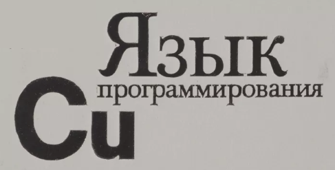
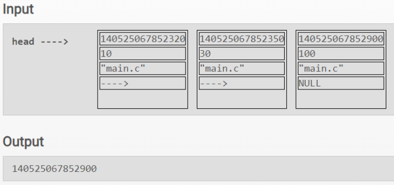
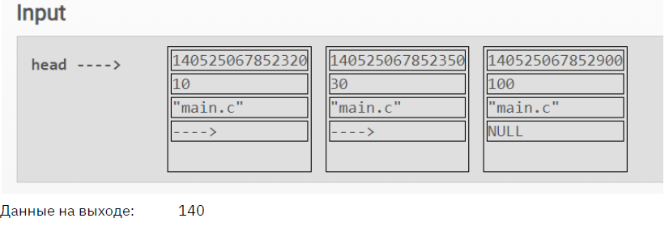

# Программирование на Си. Продвинутый уровень.

### В этом проекте рассмотрены: 

* [Вводный урок](#title1)

* [Структуры. Динамические типы](#title2)

* [Библиотеки языка С](#title3)

-----

### <a id="title1">Часть 1</a>

<strong> &#128194; hw1. Вводный урок</strong> 

(<a href="#readme-top">вверх</a>)

-----

### <a id="title2">Часть 2</a>

<strong> &#128194; hw2. Структуры. Динамические типы</strong> 

* <strong> 1.c </strong> Функция void * findMaxBlock(list *head), которая в списке находит адрес блока памяти
занимающий больше всего места

* <strong> 2.c </strong> Функция size_t totalMemoryUsage(list *head), которая анализирует список и возвращает
сколько всего памяти используется.

(<a href="#readme-top">вверх</a>)

-----

### <a id="title3">Часть 3</a>

<strong> &#128194; hw3. Библиотеки языка С</strong> 

(<a href="#readme-top">вверх</a>)

-----

(<a href="#readme-top">вверх</a>)
